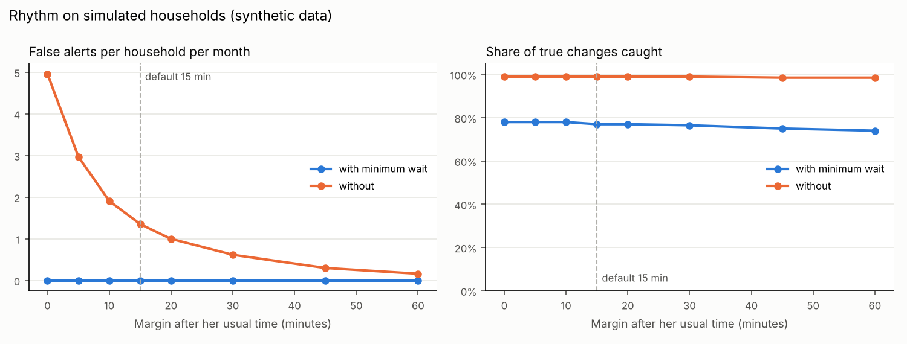

# Evaluation on simulated households

**All data here is synthetic.** It shows how Rhythm's rule behaves on realistic routines; it is not
a measurement on real people. Regenerate it with `python scripts/evaluate.py`.

## Setup

- 60 simulated households, 16 weeks each; the first 14 days are the silent learning period.
- Each household has its own weekday wake time (06:30–08:30), a weekend time 20–90 min later,
  10–25 min of day-to-day noise, and ordinary sleep-ins (5% of days, 30–90 min late).
- Distractions: night events on 20% of days (01:00–04:30) and doorbell presses on 15% of days.
- One announced 3–6 day trip per household (marked with "She's away").
- True changes the family would want to hear about: late mornings (1 in 40 days, first activity
  2–4 h after her usual time) and silent days (1 in 120 days, no activity at all).
- The rule is the app's own code (`rhythm/rules.py`), run with the default settings.

## Results

| Measure | Standard (default) | Careful |
|---|---|---|
| False alerts per household per month | 0.00 (0 in 5411 normal days) | 0.07 |
| Silent days caught | 60 of 60 | 60 of 60 |
| Late mornings caught | 94 of 140 | 122 of 140 |
| Alerts during announced trips | 0 | 0 |
| Median time from her usual time to the alert | 148 min | 124 min |

## Margin and minimum wait

| Margin (min) | Minimum wait | False alerts / month | Changes caught |
|---|---|---|---|
| 0 | yes | 0.00 | 78% |
| 5 | yes | 0.00 | 78% |
| 10 | yes | 0.00 | 78% |
| 15 | yes | 0.00 | 77% |
| 20 | yes | 0.00 | 77% |
| 30 | yes | 0.00 | 76% |
| 45 | yes | 0.00 | 75% |
| 60 | yes | 0.00 | 74% |
| 0 | no | 4.96 | 99% |
| 5 | no | 2.97 | 99% |
| 10 | no | 1.91 | 99% |
| 15 | no | 1.35 | 99% |
| 20 | no | 1.00 | 99% |
| 30 | no | 0.62 | 99% |
| 45 | no | 0.30 | 98% |
| 60 | no | 0.16 | 98% |

## What this shows

- The minimum wait (10:00 weekdays, 11:00 weekends) is what keeps false alerts near zero: without it,
  small margins alert on ordinary sleep-ins.
- Silent days are always caught. Late mornings are caught when they run past the minimum wait;
  an early riser who gets up two hours late but still before 10:00 is not reported. That is the
  deliberate trade-off: Rhythm prefers missing a mild delay to crying wolf.
- The "Careful" sensitivity lowers the minimum wait by 30 minutes for families who want earlier notice.
- Night events and doorbell presses never hid a silent morning, because they are not counted as her activity.
- Limits: the routines are invented, real households vary in ways this model does not capture,
  and the thresholds are not clinically calibrated.
